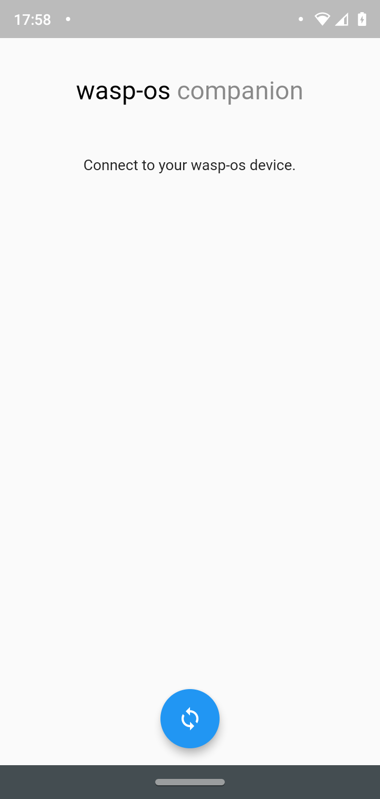
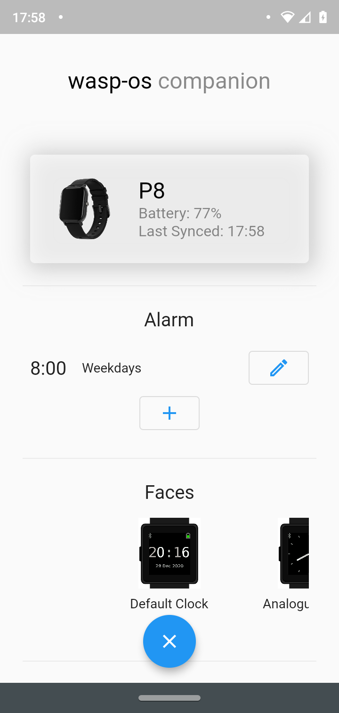
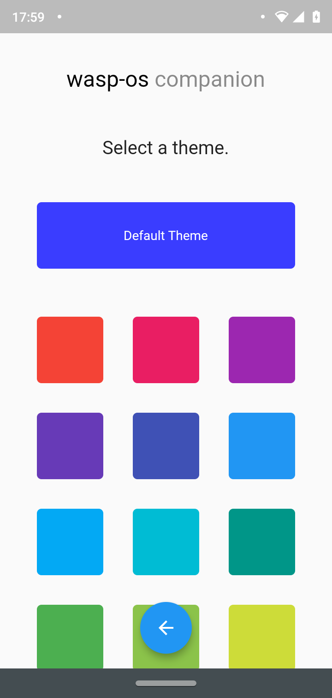
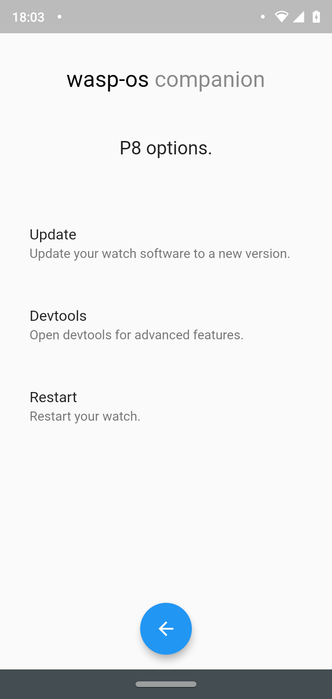
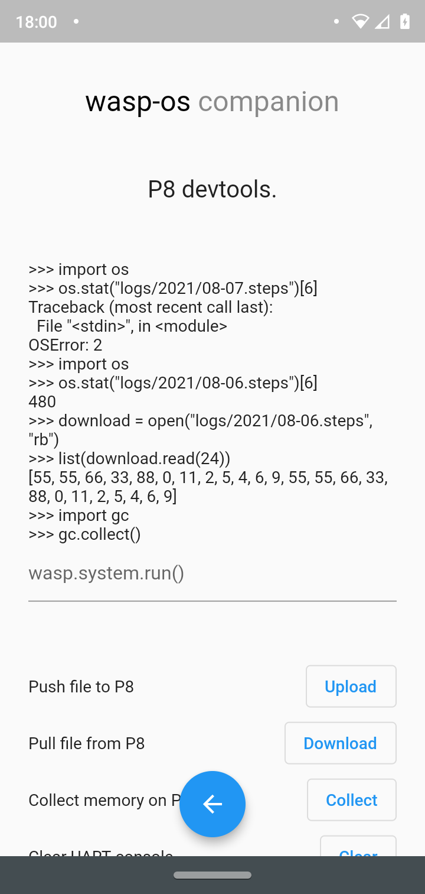

# wasp-os companion

A companion app for [wasp-os](https://github.com/daniel-thompson/wasp-os/) smartwatches.

This app is still in early development, so there may be bugs.

As I use a Windows computer, I cannot create the iOS portion of this app. If you have an Apple device and would like to contribute, then that would be awesome.

## Getting Started

wasp-os companion is built on Flutter, with native Android code for background services.
To install the app, check [Github Actions](https://github.com/tb100/wasp-os-companion/actions) for the latest version.

## Features
- Device
    - See when the device was last Synced
    - View the battery level of your device
    - Update your device
        - Recent Github releases
        - Recent Github actions
        - A local file on your phone
    - Devtools
        - View and modify the UART console
        - Upload and download files from the file system
        - Run the garbage collector on your watch
    - Reboot your device
 - Alarms
    - Add or remove alarms
    - Change the time of an alarm
    - Modify the days the alarm is enabled
- Faces
    - Change the current clock face
    - View a preview of each clock face
- Games
    - Saves your highscore on the snake game
- Music *
    - Control music playing on your phone
    - View the currently playing song
- Notifications *
    - Get notification from your phone
- Steps
    - View recent step data
    - See a graph that shows steps taken throughout a day
- Settings
    - Change the brightness
    - Change the notification level
    - Change the units
    - Set a theme
- Extra Features
    - Apps can make network requests
        - See [networking](.docs/NETWORK.md)

###### * Works in the background with the app closed
 
## Tested Devices
I only have a P8 smartwatch, so I haven't tested with PineTime or K9. Please make a pull request if you have tested the app with a new phone/watch.
 - Phone:
     - Android 10
     - Android 9
 - Watch:
     - P8

## Screenshots
           
        

#### App Icon from [Icons8](https://icons8.com/).