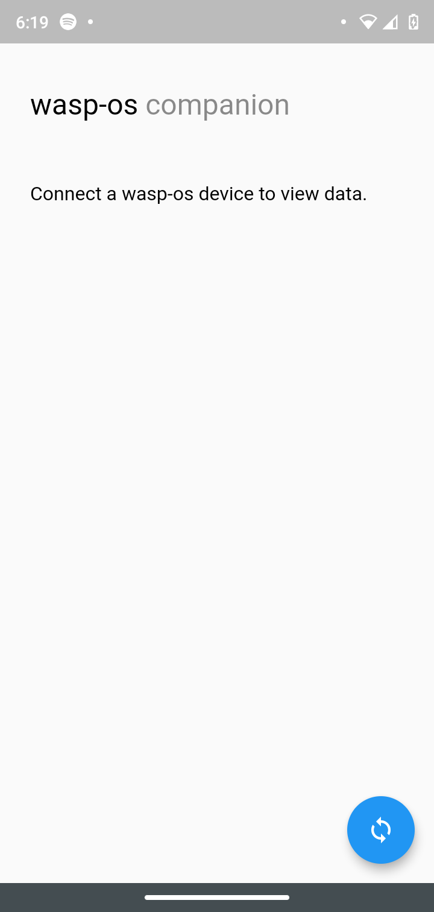
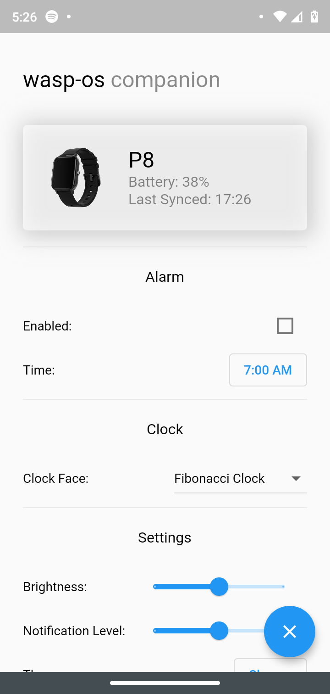
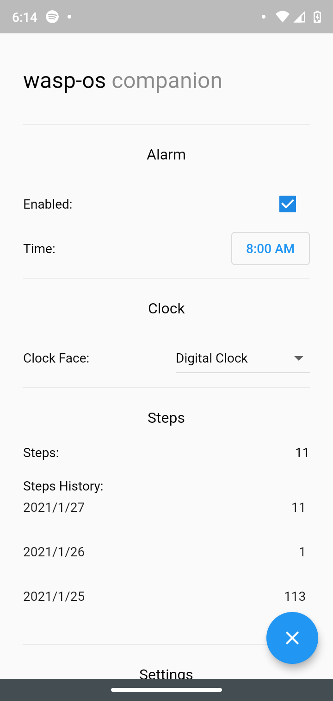
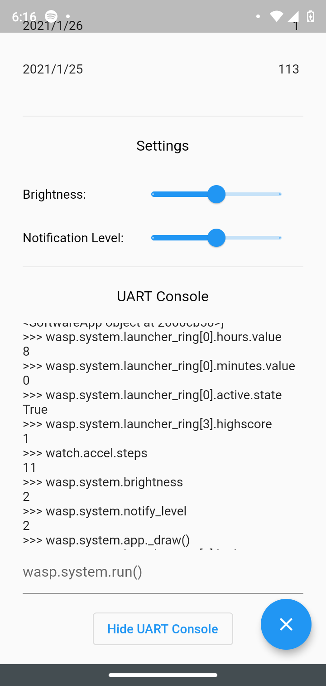
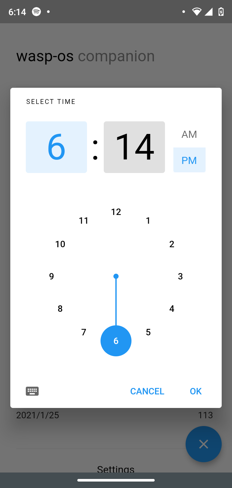
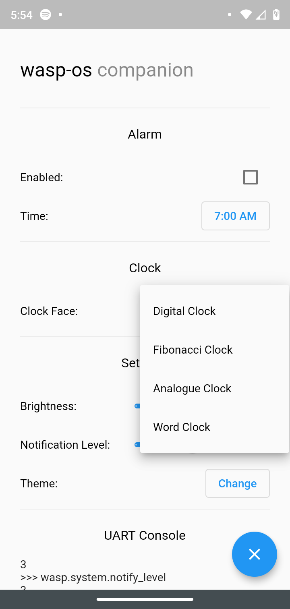
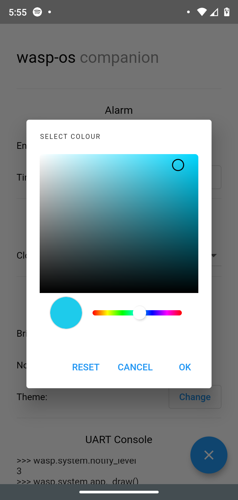
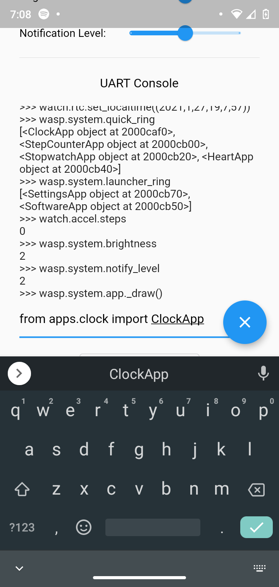
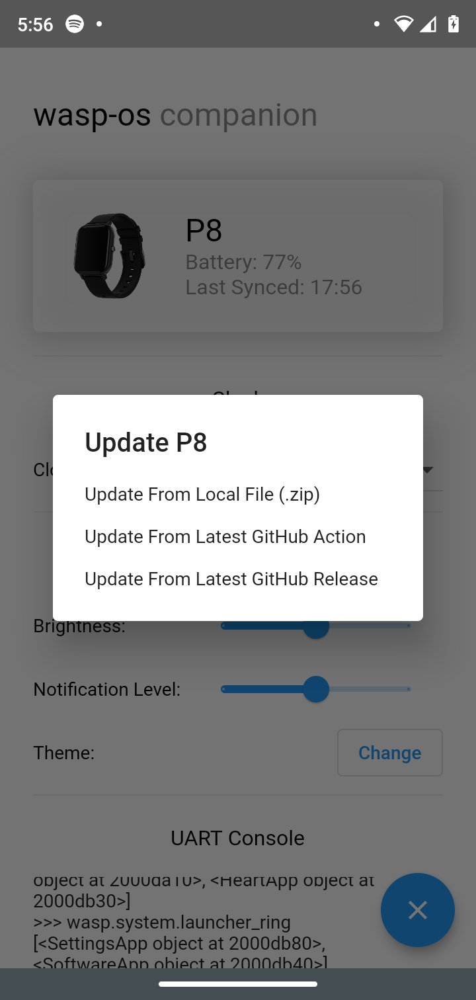
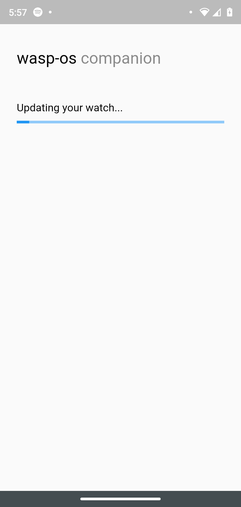

# wasp-os companion

A companion app for [wasp-os](https://github.com/daniel-thompson/wasp-os/) smartwatches.

This app is still in early development, so there may be bugs.

As I use a Windows computer, I cannot create the iOS portion of this app. If you have an Apple device and would like to contribute, then that would be awesome.

## Getting Started

wasp-os companion is built on Flutter, with native Android code for background services.
To install the app, check [Github Actions](https://github.com/tb100/wasp-os-companion/actions) for the latest version.

## Features
 - Change current alarm.
 - Change clock face.
 - View steps (with history).
 - Change watch settings (brightness/notification level).
 - Change the watch theme.
 - Automatically sync the time.
 - UART console.
 - View watch battery percentage.
 - Save/load snake game high score.
 - Get phone notifications.
 - Get now playing media.
 - Control now playing media.
 - Update the watch with a new firmware version either from local storage, the latest [GitHub Action](https://github.com/daniel-thompson/wasp-os/actions), or the latest [GitHub Release](https://github.com/daniel-thompson/wasp-os/releases).
 - Allows watch apps to make web requests (see [networking](.docs/NETWORK.md)).
 - App UI mirrors watch applications (for example, if the alarm app isn't enabled, this app doesn't show options for the alarm app).
 - Runs in the background so you can get notifications and control music even if the app is closed.
 
## Tested Devices
I only have a P8 smartwatch, so I haven't tested with PineTime or K9. Please make a pull request if you have tested the app with a new phone/watch.
 - Phone:
     - Android 10
     - Android 9
 - Watch:
     - P8

## Screenshots
           
         

#### App Icon from [Icons8](https://icons8.com/).